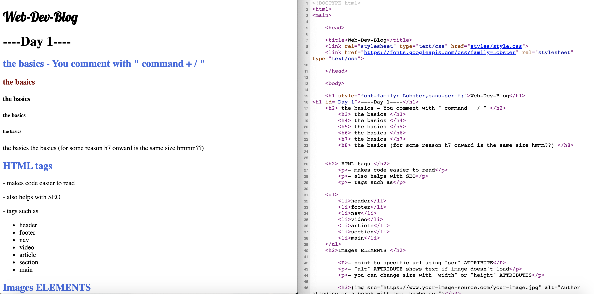

# WebDevBlog


Blog-Style website introducing HTML, CSS and JavaScript for beginners

[Live Website Link](https://zaeyyd.github.io/WebDevBlogSC)



* Sections of the website are divided into "DAYS". 

* I learn new HTML/CSS concepts every DAY, and then use those new concepts to code the next DAY. 

* Each DAY has information on how to code that DAY... kind of meta :o 

```
Feel free to check out the Live Website Link above to get a better idea :)
```


